# Code Proxy

一个智能的 Claude API 代理服务器，为 Claude Code CLI 提供负载均衡、故障转移和请求监控功能。

## 功能特性

- 🚀 **智能路由** - 自动选择可用的 API 端点，支持故障转移和重试
- 📊 **实时监控** - 可视化请求统计、Token 使用量和 API 成本
- 🔄 **流式响应支持** - 完整支持 Claude API 的 SSE (Server-Sent Events) 流式响应
- 💾 **请求日志** - 详细记录所有请求和响应数据，包括 headers、body 和性能指标
- 🎯 **多端点管理** - 支持配置多个 API 端点，可以是官方 Anthropic API 或第三方聚合服务
- 📈 **使用热度图** - 全年每日 Token 使用可视化
- 🌓 **深色模式** - 支持浅色/深色主题切换
- 💾 **配置导入导出** - 方便地备份和迁移配置
- 🔧 **Claude Code 集成** - 自动配置 Claude Code CLI 使用代理

## 快速开始

### 环境要求

- Flutter SDK 3.10.1 或更高版本
- macOS (主要支持平台，其他平台也可以运行)

### 安装

```bash
# 克隆仓库
git clone <repository-url>
cd code_proxy

# 安装依赖
flutter pub get

# 运行应用
flutter run -d macos
```

### 首次使用

1. **启动应用** - 应用会自动启动代理服务器（默认端口 9000）
2. **添加端点** - 在"端点管理"页面添加你的 Claude API 端点
   - 端点名称：自定义名称
   - API Base URL：例如 `https://api.anthropic.com`
   - API Key：你的 Anthropic API 密钥
3. **启用端点** - 确保至少有一个端点处于启用状态
4. **开始使用** - 代理会自动配置 Claude Code CLI，现在可以正常使用 Claude Code

## 配置说明

### 端点配置

每个端点支持以下配置：

- **基础设置**
  - 名称、备注
  - 启用/禁用状态
  - 权重（用于负载均衡）

- **API 设置**
  - Anthropic Base URL
  - API Key
  - 请求超时时间

- **模型配置**
  - 默认模型
  - Small Fast Model（快速模型）
  - Haiku/Sonnet/Opus 默认模型

- **高级设置**
  - 禁用非必要流量

### 代理服务器配置

在"设置"页面可以配置：

- 监听地址（默认：127.0.0.1）
- 监听端口（默认：9000）
- 请求超时时间
- 最大重试次数
- 日志保留条数

## 工作原理

```
Claude Code CLI
       ↓
[~/.claude/settings.json] → 配置为使用本地代理
       ↓
Code Proxy (localhost:9000)
       ↓
自动选择端点 → 端点 1 (Anthropic API)
             → 端点 2 (备用服务)
             → 端点 3 (其他服务)
```

代理服务器会：
1. 拦截 Claude Code 的所有 API 请求
2. 按顺序尝试已启用的端点
3. 遇到失败时自动重试或切换到下一个端点
4. 记录所有请求的详细信息（Token 使用、耗时等）
5. 支持流式和非流式响应

## 流程图

```mermaid
sequenceDiagram
    participant CLI as Claude Code CLI
    participant Service as ProxyServerService
    participant Router as ProxyServerRouter
    participant ReqHandler as ProxyServerRequestHandler
    participant Mapper as ProxyServerModelMapper
    participant HTTPClient as HTTP Client
    participant Endpoint1 as Endpoint 1 (失败)
    participant Endpoint2 as Endpoint 2 (成功)
    participant RespHandler as ProxyServerResponseHandler
    participant Processor as ResponseProcessor
    participant Cleaner as HeaderCleaner
    participant Recorder as StatsRecorder
    participant StatsCollector as StatsCollector Service

    %% 1. 请求到达
    CLI->>+Service: POST /v1/messages (原始请求)
    Note over Service: _proxyHandler()
    Service->>Service: 读取请求体 rawBody
    Service->>Service: 记录 startTime

    %% 2. 路由阶段
    Service->>+Router: routeRequest(endpoints, executor)
    Note over Router: 遍历所有启用的端点

    %% 3. 尝试 Endpoint 1 (将会失败)
    Router->>Router: _tryEndpoint(endpoint1)
    Note over Router: attempt = 0

    %% 4. 准备请求
    Router->>+Service: executor(endpoint1)
    Service->>+ReqHandler: prepareRequest(request, endpoint1, rawBody)

    ReqHandler->>ReqHandler: _buildTargetUrl()
    Note over ReqHandler: 构建: https://api1.com/v1/messages

    ReqHandler->>ReqHandler: _prepareHeaders()
    Note over ReqHandler: 替换 authorization → x-api-key

    ReqHandler->>ReqHandler: _processRequestBody(rawBody)
    ReqHandler->>+Mapper: mapModel("ANTHROPIC_MODEL", endpoint1)
    Mapper-->>-ReqHandler: "claude-sonnet-4-5-20250929"
    Note over ReqHandler: 替换请求体中的 model 字段

    ReqHandler-->>-Service: http.Request (已准备)
    Note over Service: 存储 _lastMappedRequestBody

    %% 5. 转发请求到 Endpoint 1
    Service->>+ReqHandler: forwardRequest(preparedRequest)
    ReqHandler->>+HTTPClient: send(request)
    HTTPClient->>+Endpoint1: POST https://api1.com/v1/messages
    Endpoint1-->>-HTTPClient: 500 Internal Server Error
    HTTPClient-->>-ReqHandler: StreamedResponse(500)
    ReqHandler-->>-Service: StreamedResponse(500)

    %% 6. 处理 5xx 响应 (第一次尝试)
    Service-->>-Router: StreamedResponse(500)
    Router->>Router: _getResponseHandler(500)
    Note over Router: 使用 ServerErrorHandler
    Router->>Router: ServerErrorHandler.handle()
    Note over Router: attempt < maxRetries<br/>返回 null (需要重试)

    %% 7. 重试 Endpoint 1 (attempt = 1)
    Router->>Router: attempt = 1
    Router->>+Service: executor(endpoint1)
    Service->>+ReqHandler: prepareRequest(...)
    ReqHandler-->>-Service: http.Request
    Service->>+ReqHandler: forwardRequest(...)
    ReqHandler->>+HTTPClient: send(request)
    HTTPClient->>+Endpoint1: POST https://api1.com/v1/messages
    Endpoint1-->>-HTTPClient: TimeoutException
    HTTPClient-->>-ReqHandler: throw TimeoutException
    ReqHandler-->>-Service: throw TimeoutException
    Service-->>-Router: throw TimeoutException

    %% 8. 处理异常 (第二次尝试)
    Router->>Router: ExceptionHandler.handle()
    Note over Router: attempt < maxRetries<br/>返回 null (需要重试)

    %% 9. 再次重试 Endpoint 1 (attempt = 2)
    Router->>Router: attempt = 2
    Router->>+Service: executor(endpoint1)
    Service->>ReqHandler: prepareRequest + forwardRequest
    ReqHandler->>HTTPClient: send(request)
    HTTPClient->>+Endpoint1: POST https://api1.com/v1/messages
    Endpoint1-->>-HTTPClient: 503 Service Unavailable
    HTTPClient-->>ReqHandler: StreamedResponse(503)
    ReqHandler-->>Service: StreamedResponse(503)
    Service-->>-Router: StreamedResponse(503)

    %% 10. 达到重试上限，标记端点不可用
    Router->>Router: ServerErrorHandler.handle()
    Note over Router: attempt >= maxRetries<br/>端点1耗尽重试次数
    Router->>StatsCollector: onEndpointUnavailable(endpoint1)
    Note over StatsCollector: 标记 endpoint1 为不可用
    Router->>Router: 返回 RouteResult.failed

    %% 11. 尝试 Endpoint 2 (将会成功)
    Router->>Router: 继续下一个端点
    Router->>Router: _tryEndpoint(endpoint2)
    Note over Router: attempt = 0

    Router->>+Service: executor(endpoint2)
    Service->>+ReqHandler: prepareRequest(request, endpoint2, rawBody)
    ReqHandler->>ReqHandler: _buildTargetUrl()
    Note over ReqHandler: 构建: https://api2.com/v1/messages
    ReqHandler->>ReqHandler: _prepareHeaders()
    ReqHandler->>ReqHandler: _processRequestBody()
    ReqHandler->>+Mapper: mapModel("ANTHROPIC_MODEL", endpoint2)
    Mapper-->>-ReqHandler: "claude-3-5-sonnet-20241022"
    Note over ReqHandler: endpoint2 使用不同的模型名
    ReqHandler-->>-Service: http.Request
    Service->>+ReqHandler: forwardRequest(preparedRequest)
    ReqHandler->>+HTTPClient: send(request)
    HTTPClient->>+Endpoint2: POST https://api2.com/v1/messages

    %% 12. Endpoint 2 返回流式响应
    Endpoint2-->>-HTTPClient: 200 OK<br/>content-type: text/event-stream
    Note over Endpoint2: 流式响应 (SSE)
    HTTPClient-->>-ReqHandler: StreamedResponse(200, stream)
    ReqHandler-->>-Service: StreamedResponse(200, stream)
    Service-->>-Router: StreamedResponse(200, stream)

    %% 13. 路由成功
    Router->>Router: _getResponseHandler(200)
    Note over Router: 使用 SuccessHandler
    Router->>Router: SuccessHandler.handle()
    Note over Router: 返回 RouteResult.success
    Router-->>-Service: RouteResult.success(response, endpoint2)

    %% 14. 处理响应
    Service->>+RespHandler: handleResponse(response, endpoint2, ...)

    RespHandler->>+Processor: isStream(headers)
    Processor-->>-RespHandler: true (text/event-stream)

    RespHandler->>+Cleaner: clean(headers)
    Note over Cleaner: 移除 transfer-encoding<br/>content-encoding<br/>content-length
    Cleaner-->>-RespHandler: cleanHeaders

    RespHandler->>+Processor: processStreamResponse(response, ...)
    Note over Processor: 创建 StreamTransformer

    %% 15. 流式数据传输
    Processor->>Processor: transform stream
    Processor->>CLI: data: {"type":"message_start",...}
    Note over Processor,CLI: 流式传输数据块
    Processor->>CLI: data: {"type":"content_block_delta",...}
    Processor->>CLI: data: {"type":"content_block_delta",...}
    Processor->>CLI: data: {"type":"message_delta","usage":{...}}
    Processor->>CLI: data: [DONE]

    %% 16. 流结束，记录统计
    Note over Processor: StreamTransformer.handleDone
    Processor->>+Recorder: recordStats()
    Recorder->>Recorder: 构建 ProxyServerRequest
    Recorder->>Recorder: 构建 ProxyServerResponse
    Recorder->>StatsCollector: onRequestCompleted(endpoint2, req, resp)
    Note over StatsCollector: 记录到数据库:<br/>- 请求/响应详情<br/>- token 使用<br/>- 响应时间<br/>- TTFB
    Recorder-->>-Processor: void

    Processor-->>-RespHandler: shelf.Response(200, stream)
    RespHandler-->>-Service: shelf.Response(200, stream)

    %% 17. 返回给客户端
    Service-->>-CLI: 200 OK (流式响应)
    Note over CLI: 接收完整流式响应

    %% 完成
    Note over CLI,StatsCollector: ✓ 请求完成<br/>Endpoint 1: 失败 (3次重试)<br/>Endpoint 2: 成功
```



## 技术栈

- **UI 框架**: Flutter 3.10+
- **状态管理**: signals (响应式编程)
- **依赖注入**: GetIt
- **路由**: auto_route
- **数据库**: SQLite (sqlite3)
- **HTTP 服务器**: shelf
- **HTTP 客户端**: http

## 开发

### 运行开发版本

```bash
flutter run -d macos
```

### 代码生成

修改路由定义后需要重新生成代码：

```bash
dart run build_runner build --delete-conflicting-outputs
```

### 代码检查

```bash
flutter analyze
```

### 测试

```bash
flutter test
```

### 构建发布版本

```bash
# macOS
flutter build macos

# Windows
flutter build windows

# Linux
flutter build linux
```

## 项目结构

```
lib/
├── di.dart                      # 依赖注入配置
├── main.dart                    # 应用入口
├── model/                       # 数据模型
│   ├── endpoint_entity.dart     # 端点配置
│   ├── proxy_server_config_entity.dart
│   └── ...
├── page/                        # 页面组件
│   ├── home_page.dart           # 主页（仪表盘）
│   ├── endpoint_page.dart       # 端点管理
│   ├── log_page.dart            # 请求日志
│   └── setting_page.dart        # 设置
├── router/                      # 路由配置
├── services/                    # 业务逻辑服务
│   ├── proxy_server/            # 代理服务器实现
│   ├── config_manager.dart      # 配置管理
│   ├── database_service.dart    # 数据库服务
│   ├── stats_collector.dart     # 统计收集
│   └── ...
├── view_model/                  # 视图模型（状态管理）
├── widgets/                     # 可复用组件
└── themes/                      # 主题配置
```

## 数据存储

- **数据库位置**: 使用系统应用数据目录
- **Claude Code 配置**: `~/.claude/settings.json`
- **配置备份**: `~/.claude/settings.json.backup`

## 常见问题

### 代理未自动配置 Claude Code？

检查 `~/.claude/settings.json` 文件权限，确保应用有读写权限。

### 请求失败或超时？

1. 检查端点配置是否正确
2. 确认 API Key 有效
3. 检查网络连接
4. 尝试增加请求超时时间

### 如何恢复原始 Claude Code 配置？

应用会自动创建备份文件 `~/.claude/settings.json.backup`，可以手动恢复或在应用中停止代理服务器时自动恢复。

## 贡献

欢迎提交 Issue 和 Pull Request！

## 许可证

[许可证信息待补充]
